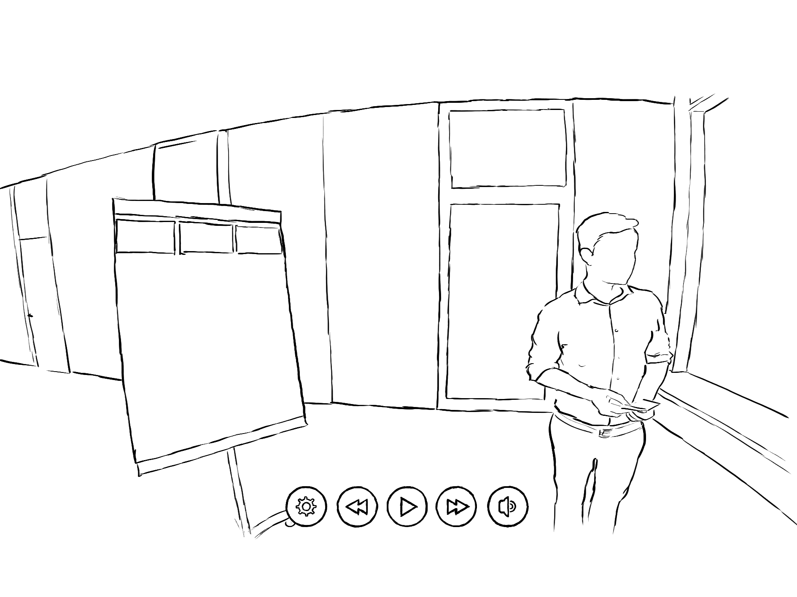
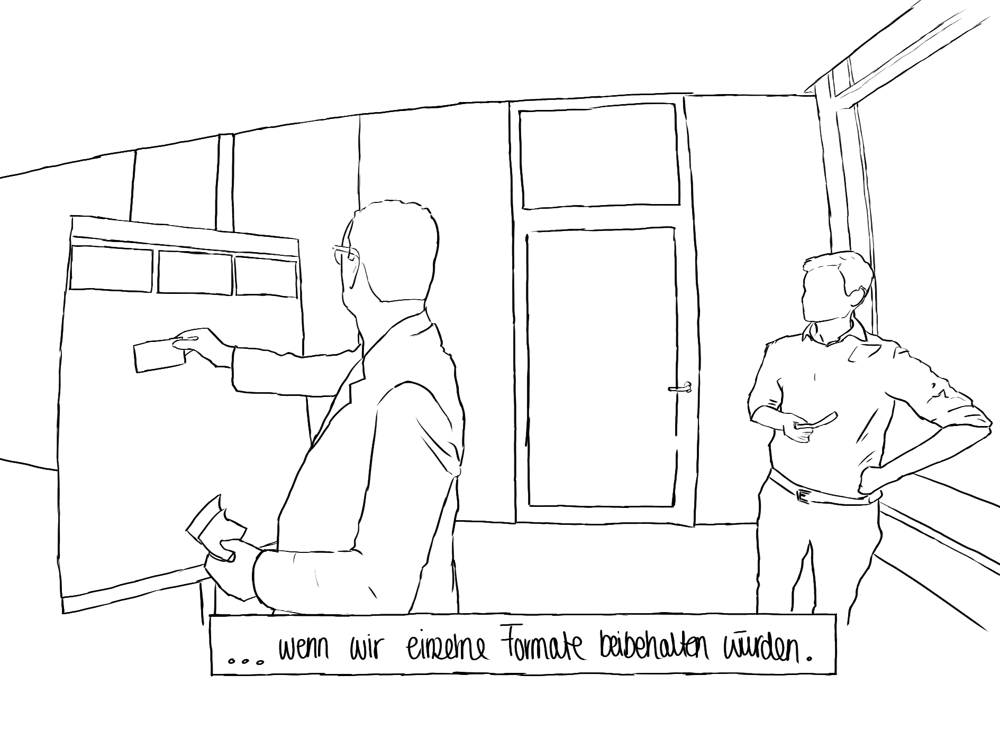
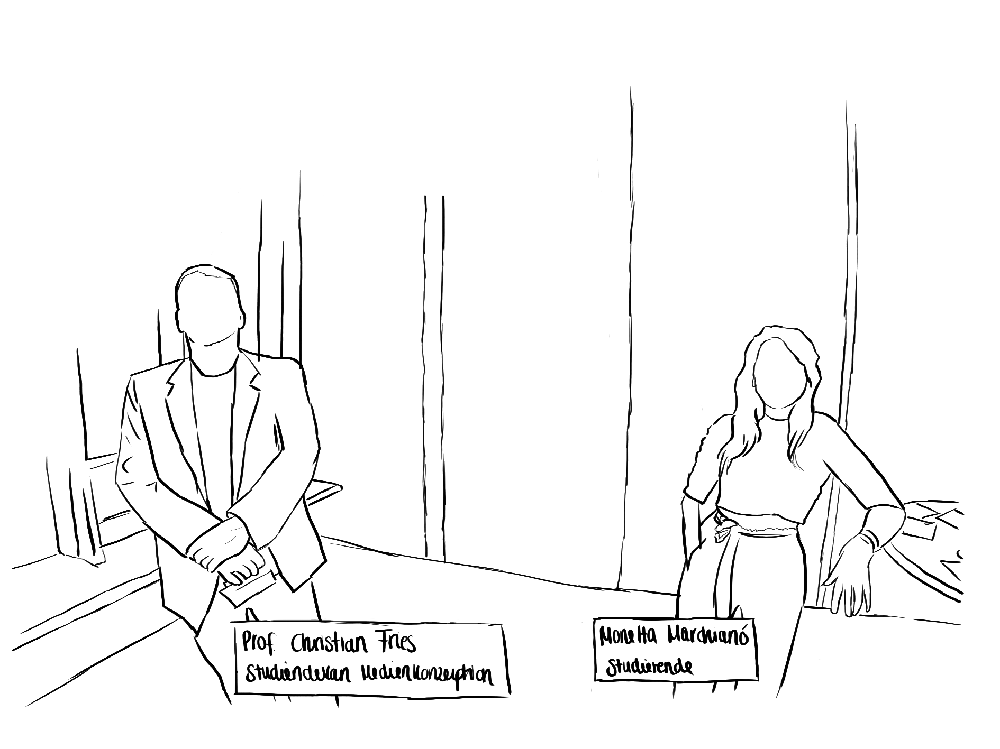

<h1>Aufgabe 7 - Video Prototyp</h1>

<h2>Konzept/Storyboard</h2>

<h3>1. Play und Pause</h3>
Es ist wichtig, dass der User die Möglichkeit hat das Video zu pausieren, zu stoppen oder vorzuspulen oder zurückzuspulen.

    

<a href="https://www.youtube.com/watch?v=8eWSGiFbizE&ab_channel=DanielHollenbach"><h3>Videobeispiel</h3></a>

<h3>2. Untertitel</h3>
Ein weiteres nützliches Feature ist das Einfügen von Untertiteln. Dies trägt nicht nur zur allgemeinen Verständlichkeit bei, sondern gewährt auch eine gewisse Barrierefreiheit.

    

<a href="https://www.youtube.com/watch?v=CgZ2BJDMMOg&ab_channel=DanielHollenbach"><h3>Videobeispiel</h3></a>

<h3>3. Bauchbinden</h3>
Wer ist diese Person im Video? Wer spricht gerade? Damit man sich solche Frage nicht stellen muss, werden an relevanten Punkten Bauchbinden zu den jeweiligen Personen eingeblendet.

    

<a href="https://www.youtube.com/watch?v=qVwA3SeX_l0&ab_channel=DanielHollenbach"><h3>Videobeispiel</h3></a>

